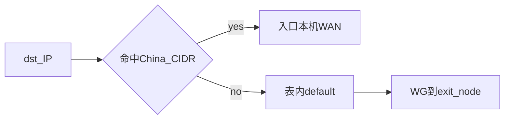

# 运维手册

## 1. 控制面 Web：刷新出现 nginx 404

**说明**：管理台使用 **vite-ssg** 构建：**History 路由**（`/login`、`/network-segments` 等，无 `#`）。对**已预渲染**的静态路径，`dist` 内存在对应目录（如 `network-segments/index.html`），多数静态服务器在访问 `/network-segments/` 时会返回该文件；**无尾斜杠**的 `/network-segments` 是否自动落到目录取决于服务器（部分需一条「目录补斜杠」或等价配置，与「整站 SPA 伪静态」不是同一类规则）。

**未在构建期生成**的路径（**动态路由** `/nodes/:id`）磁盘上无对应 HTML，**刷新或直开**该 URL 仍可能 404，请从「节点管理」站内进入节点详情。

若仍 404：检查网站 **根目录** 是否指向完整 **`dist`**、**首页** `https://域名/` 能否打开；**不要**把「API 连接」里的后端根地址填成页面域名（见「API 连接」说明）。

---

## 2. 节点无法上线

**现象**：Web 端节点状态一直显示 offline。

**排查步骤**：
1. 确认 vpn-agent 服务运行：`systemctl status vpn-agent`
2. 查看 agent 日志：`journalctl -u vpn-agent -f`
3. 确认节点能访问控制面：`curl -v https://vpn-api.company.com/api/health`
4. 确认 bootstrap token 正确：检查 `/etc/vpn-agent/agent.json`
5. 确认防火墙放行控制面 **56700/tcp**（或经 Nginx 的 443/tcp）和 **56720/udp**（WireGuard）

## 3. 换发节点 token / 重装节点后：授权删不掉或接口 404

**现象**：换发 bootstrap token 并在节点上重装后，用户授权列表里旧记录删不掉，或提示「接口不存在 (404）」、证书 CN 冲突。

**原因简述**：

- 控制面数据在 **`vpn.db`**（SQLite）中；**换发 token、重装节点脚本不会删除**库里的 **用户授权**（`user_grants`）。`cert_cn` 有唯一约束，旧行不清理会挡新授权。
- **404** 多为两类：①「API 连接」填错（页面端口、或根地址带 `/api` 导致请求变成 `/api/api/...`）；② **`vpn-api` 进程仍是旧二进制**，没有 `DELETE /api/grants/:id/purge` 路由。

**建议步骤**：

1. **管理台「API 连接」**：根地址为 **`http://<控制面>:56700`**（无路径、**不要**带 `/api`）。保存后点 **「测试连接」**：应提示支持 **grant_purge**；若提示需升级后端，请重新编译并**只启动一个** `vpn-api` 进程。
2. **删历史授权**：用户管理 → 授权 → 对非「有效」证书点 **删除**（物理删行）。若仍为 **active**，先 **吊销** 再删。
3. **或删节点**：节点管理删除该节点（会删除该节点实例下的授权行），再重新添加节点。
4. 浏览器 **开发者工具 → Network**：删除授权时请求 URL 应为 **`.../api/grants/<id>/purge`**，且路径中 **只出现一次** `/api`。

---

## 4. 用户连接失败

**排查步骤**：
1. 确认 OpenVPN 实例运行：`systemctl status openvpn-<mode>`
2. 查看 OpenVPN 日志：`tail -f /var/log/openvpn/<mode>.log`
3. 确认证书未被吊销：Web 端查看用户授权状态
4. 确认客户端使用正确的 .ovpn 文件
5. 确认防火墙放行对应 OpenVPN 端口：**UDP 与 TCP 以该实例 `instances.proto` 为准**（默认网段常见 **56710–56712**，以节点详情为准）。

### 3.1 Web 显示 TCP 与用户 .ovpn 仍是 UDP；或 remote 端口与 proto 不一致

**行为说明（当前版本）**：

- **在线签发**时，`.ovpn` 中的 **`remote` 端口与 `proto` 均以控制面数据库为准**（与 `GET /api/nodes/<id>` 返回的 **`instances[].port` / `instances[].proto`** 一致），避免曾出现的「库已是 TCP 端口但首部仍是 `proto udp`」组合。
- **新建**或 **保存** **组网接入**（CreateInstance / PATCH 实例）或网段 **「将默认协议同步到已有实例」** 后，若该节点 **Agent 在线**，控制面会通过 WebSocket 下发 **`update_config`**：节点写入 **`/etc/vpn-agent/last-config.json`**，并按实例列表更新各 **`/etc/openvpn/server/<mode>/server.conf`** 的 `port` / `proto`，再执行 **`systemctl try-restart openvpn-<mode>`**。
- **`bootstrap-node.json`** 仍由节点安装脚本生成；**`last-config.json` 优先**用于 Agent 在「未带 proto 的签发请求」等场景下的本机回退，以及 **在线用户数** 统计时的实例列表（有 `last-config` 时优先于 bootstrap）。

**建议核对**：

1. 使用管理 Token 调用 **`GET /api/nodes/<节点ID>`**，确认对应 **`mode`** 的 **`proto`**、**`port`** 与预期一致。
2. 调用 **`GET /api/users/<用户ID>/grants`**（或管理台授权列表），确认 **`instance_id`** 指向该实例。
3. 若库内 **`proto` 已是 `tcp`**，但下载的 `.ovpn` 仍旧：在授权上 **重试签发**（`ovpn_content` 存的是上次签发结果）。
4. 若用户仍连不上：在节点上核对 **`/etc/openvpn/server/<mode>/server.conf`** 中 **`proto` / `port`** 是否与库一致；查 **`journalctl -u vpn-agent`** 是否出现 **`received config update`**、**`openvpn apply`**、**`try-restart openvpn-`** 等关键字；确认 **`vpn-agent` 与 `vpn-api` 均为新版本** 且节点 **在线**（离线时不会收到 `update_config`，需上线后再次保存实例或等待后续同步手段）。
5. 若 **`bootstrap-node.json` 与库长期不一致**且从未成功落盘 `last-config`：可编辑并保存一次该节点实例（触发推送），或在节点上按安装文档重新执行会重写 bootstrap 的步骤，使本机与库对齐后再 **重试签发**。

### 3.1.1 控制面与节点 JSON 不同步时如何排障

**常见现象**：Web 上已改为 TCP，但本机 `bootstrap-node.json` 里仍是 UDP；或 `server.conf` 未监听新端口。

**日志关键字（vpn-agent）**：`received config update`、`config saved to /etc/vpn-agent/last-config.json`、`merged ... instance(s) into ... bootstrap-node.json`（新版）、`openvpn apply`、`try-restart openvpn-`。

**日志关键字（vpn-api）**：`push instances config`（推送失败时会打错误）。

**重试签发前建议满足**：`GET /api/nodes/<id>` 中 **`instances`** 与节点上 **`server.conf` 的 port/proto** 一致；在线节点应已写入 **`last-config.json`**（可与 API 返回的实例列表对照）。若仅改库、节点离线且从未收到推送，签发头虽与库一致，服务端仍可能监听旧配置，客户端仍会失败。

### 3.2 出口节点（`instances.exit_node`）

**`node-direct`（节点直连）**：默认**留空**表示客户端全局流量经**本入口节点**公网出口（NAT 到本机 WAN）；脚本会推送 **`redirect-gateway`**。若填写 **对端节点 ID**（须与本节点「相关隧道」一致），则该实例流量经 **WireGuard 到对端**再出网。

**`cn-split`（国内分流）/ `global`（全局）**：可在 **`instances.exit_node`** 中填写对端节点 ID。节点上 **`policy-routing.sh`**（由 `node-setup.sh` 生成）用该 ID 在 **`bootstrap-node.json` 的 `tunnels`** 里解析对端 WG 内网 IP；**留空**时仍尝试旧版内置名（`hongkong`/`hong-kong`）。

**配置步骤**：

1. 在 **节点详情 → 相关隧道** 中确认本节点与目标出口之间已有一条隧道（状态为已连接），并记下对端列展示的 **节点 ID**。
2. 在 **组网接入** 对应模式的 **出口节点** 下拉中选择该 ID（或清空），保存。API 会校验非空 `exit_node` 须为本节点某隧道的对端。
3. **在线节点**：保存后控制面会通过 WebSocket 下发 `update_config`；**vpn-agent（新版本）** 会把 **`instances` 合并进 `/etc/vpn-agent/bootstrap-node.json`** 并 **`systemctl restart vpn-routing.service`**（执行 `policy-routing.sh` 与 `nat-rules.sh`），使 **出口节点 / 子网 / 启用** 与 `last-config.json` 一致。**若节点仍为旧版 Agent**，则须在入口机上 **重新执行** 安装脚本（或至少手动执行 `policy-routing.sh` / `nat-rules.sh`）。**注意**：`update_config` **不会**在 `server.conf` 中补写 `redirect-gateway` 或新建 OpenVPN 实例目录；从旧语义升级或**首次启用**某模式仍须在节点上重跑含 OpenVPN 配置生成的 **node-setup.sh** 步骤。

#### 3.2.1 出口节点：隧道转发与出网 NAT（邻节点经本机出公网）

**场景**：入口节点 A 上用户走 `cn-split` / `global` / `node-direct`+`exit_node`，策略路由把海外（或全部）流量经 **WireGuard 送到出口节点 B**，再由 B 访问公网。

**要点**：B 上除「本机 OpenVPN 子网」的 NAT 外，还须对 **从 `wg-<对端节点ID>` 进入、从本机默认路由网卡转出** 的转发流量做 **MASQUERADE**。否则进入 B 的数据包源地址仍为隧道链路私网地址，公网回程不可达，表现为「直连 A 国内正常、直连 B 海外正常，但连 A 借 B 出口时海外全挂」。

**脚本行为**：新版 `node-setup.sh` 生成的 `/etc/vpn-agent/nat-rules.sh` 会按 `bootstrap-node.json` 的每条隧道追加 `iptables -t nat -A VPN_POSTROUTING -i wg-<peer> -o <默认网卡> -j MASQUERADE`（与现有 `DEFAULT_IF` 检测一致；多 WAN 需自行评估是否改用固定出口接口）。

**存量升级**：仅 **`systemctl restart vpn-routing.service`** 会重跑磁盘上**已有**的 `nat-rules.sh`；若该文件仍是旧模板（无上述 `wg-*` MASQUERADE），重启**不会**自动补规则。请在**出口节点及有隧道的节点**上 **重跑 `node-setup.sh`（或你们约定的部署步骤）** 以重新生成 `nat-rules.sh`，再执行 `systemctl restart vpn-routing.service` 或依赖 Agent 的 `vpn-routing` 重启。

**验证（在出口 B 上）**：

```bash
iptables -t nat -S VPN_POSTROUTING | grep -- '-i wg-'
```

应能看到每条隧道对应一条 `-i wg-<节点ID> -o <网卡> -j MASQUERADE`。在入口 A 上仍可用第 4 节中的 `ip route get 8.8.8.8`（结合客户端 VPN 源地址）确认海外走隧道。

#### 3.2.2 策略路由固定表号与验收（`policy-routing.sh`）

新版 `node-setup.sh` 生成的 **`/etc/vpn-agent/policy-routing.sh`** 对 IPv4 策略路由使用**固定表号**（不随 `instances` 在 JSON 中的顺序链式递增），避免 **`ip route flush` 误伤其它模式**或两段子网误指同一张表：

| `mode` | 路由表号 | `/etc/iproute2/rt_tables` 名称 | `ip rule` 优先级（约） |
|--------|----------|--------------------------------|-------------------------|
| `cn-split` | **101** | `vpn_hk_split` | 3210 |
| `global` | **102** | `vpn_hk_global` | 3220 |
| `node-direct` 且配置了 `exit_node` | **103** | `vpn_local_exit` | 3200 |

**部署 / 变更出口前在入口节点上核对**：

1. **`/etc/vpn-agent/bootstrap-node.json`**（或与控制面一致的 bootstrap）中，对应模式的 **`enabled`**、**`subnet`**、**`exit_node`** 符合预期；`exit_node` 须为本节点某隧道的对端节点 ID（或留空走 legacy 名）。
2. **隧道就绪**：`wg show` 中到出口对端的接口为 `up`；可 `ping` 对端隧道内网 IP。
3. **重跑策略路由与 NAT**（在线节点也可由新版 Agent 触发 `vpn-routing`）：
   ```bash
   bash /etc/vpn-agent/policy-routing.sh && bash /etc/vpn-agent/nat-rules.sh
   ```
   若磁盘上的 `policy-routing.sh` 仍是旧模板（无固定表号逻辑），请在节点上**重跑 `node-setup.sh` 中生成该脚本的一步**，使脚本与仓库版本一致后再执行上述命令。
4. **验收**（入口节点上）：
   ```bash
   ip -4 rule show
   ip route show table 101 | head -5
   ip route show table 102 | head -5
   ```
   - **`10.1.x.0/24`（第三段为 1）** 的 `cn-split` 子网应 **`lookup vpn_hk_split`（表 101）**；**第三段为 2** 的 **`global`** 子网应 **`lookup vpn_hk_global`（表 102）**。
   - 表 **101** 至少应有 **`default via … dev wg-…`**；若已部署国内列表，还会有大量国内网段。
   - 表 **102** 在启用 **`global`** 时应至少有 **一条 IPv4 `default`** 经出口 WG；脚本末尾自检失败时会 **非零退出**（`journalctl -u vpn-routing` 可见）。

### 3.3 新建节点默认启用与存量升级

**新建节点（当前版本）**：控制面为每个节点创建三套实例，但 **`enabled` 仅 `node-direct` 为 true**；`cn-split` / `global` 默认关闭。管理员在 Web **组网接入** 中**首次勾选启用**其它模式并保存后，须在节点上 **重新执行 `node-setup.sh`**，以便生成对应 **`server.conf`**、systemd 单元及监听；**已部署节点**上若仅调整 **出口 / 子网 / 启用**（实例已存在），在线 **新版 Agent** 在收到 `update_config` 后会合并 `bootstrap` 并重跑 **vpn-routing**；**从未生成过该模式的 `server.conf`** 时仍须重跑安装脚本。

**存量节点升级**：若节点上的 `node-direct` **`server.conf` 仍为旧版（无 `push redirect-gateway`）**，用户即使连上也可能与预期不符。升级 `node-setup.sh` 后请在节点上 **重跑安装脚本** 中生成 OpenVPN 与路由的步骤。行为变化：**新语义下 `node-direct` 会拉全局流量进隧道**；若业务仍需要「仅 VPN 子网、公网走用户本机」，应使用其它产品设计（例如不授权 `node-direct` 或单独文档约定），而非依赖旧脚本行为。

### 3.4 node-direct 已连接但客户端「上不了网」；节点「在线用户」长期为 0

**上不了网**：在**新语义**下，`node-direct` 应已推送默认路由；若仍异常，查 **`server.conf` 是否含 `redirect-gateway`**、节点 **NAT/转发**、以及客户端 **Kill Switch**（部分客户端在 DNS 或分路上仍会拦截）。若 `node-direct` 配置了 **`exit_node`**，确认策略路由与隧道正常（`ip rule` / `ip route show table`）。

**在线用户为 0**：Web 上人数由 **vpn-agent** 通过本机 OpenVPN **management**（`127.0.0.1:56730`–`56732`，按 **mode** 固定：`node-direct`→56730，`cn-split`→56731，`global`→56732）查询后上报。若长期为 0：检查 **`systemctl status openvpn-<mode>`**（仅 **已启用** 的实例应有服务）、Agent 日志、以及 **`server.conf`** 中 `management` 端口是否与上表一致。

建议按以下顺序快速确认：

1. `echo -e "status 3\n" | nc -w 2 127.0.0.1 56730`：确认输出存在 `CLIENT_LIST`。
2. 管理台或 `GET /api/nodes/<id>/status`：确认 `agent_version` 已升级到新版本（`0.2.1+` 或你的构建版本号）。
3. `journalctl -u vpn-agent -f`：观察是否出现 `health: management ... returned zero CLIENT_LIST rows`、`health: no instances found`、`unknown instance mode` 等诊断日志。
4. 若 `status 3` 有 `CLIENT_LIST` 但 API 仍为 0，优先怀疑节点还在跑旧版二进制（未替换或未重启）。

### 3.5 OpenVPN 服务启动循环（常见于端口被历史服务抢占）

**现象**：某个实例（不止 `node-direct`，也可能是 `cn-split` / `global`）持续 `auto-restart`，客户端反复重连失败。

**典型根因**：节点上残留系统默认服务 `openvpn-server@server`（或 `openvpn@server`）占用了实例 `server.conf` 配置的监听端口（如 1194/udp）。

**排查步骤**：
1. 查看实例与历史服务状态：
   - `systemctl status openvpn-node-direct openvpn-cn-split openvpn-global --no-pager -l`
   - `systemctl status openvpn-server@server --no-pager -l`
2. 查看端口占用：
   - `ss -ulnp | grep -E '1194|1195|1196|1197|openvpn'`
3. 确认实例配置端口/协议：
   - `grep -E '^(port|proto)' /etc/openvpn/server/<mode>/server.conf`
4. 若确认为历史服务抢占，执行：
   - `systemctl stop openvpn-server@server`
   - `systemctl disable openvpn-server@server`
   - `systemctl restart openvpn-<mode>`
5. 再次确认实例进入 `active (running)`：
   - `systemctl status openvpn-<mode> --no-pager -l`

**说明**：新版 `node-setup.sh` 在部署 Step 8 会自动清理上述历史冲突单元，并对每个启用实例执行端口冲突与健康检查；若仍失败，脚本会直接打印对应实例的近 30 行日志。

## 5. 智能分流不生效

**现象**：所有流量都走本地或都走海外。

**排查步骤**：
1. 确认 ipset 已加载：`ipset list china-ip | head`
2. 确认策略路由存在：`ip rule show`
3. 确认路由表有内容：`cn-split` 查 **表 101**（`ip route show table 101`），`global` 查 **表 102**（`ip route show table 102`）；参见 **3.2.2 节**。
4. 手动测试分流：`ip route get 114.114.114.114`（应走本地）、`ip route get 8.8.8.8`（应走隧道）
5. 重新应用规则：`bash /etc/vpn-agent/policy-routing.sh && bash /etc/vpn-agent/nat-rules.sh`（若仍异常，比对节点上 `policy-routing.sh` 是否已为**固定表号**新版，必要时重跑 `node-setup.sh` 再生脚本）

## 6. WireGuard 隧道断开

**排查步骤**：
1. 查看隧道状态：`wg show`
2. 确认对端可达：`ping <peer_public_ip>`
3. 确认对端 WireGuard 运行：SSH 到对端执行 `wg show`
4. 确认公钥匹配：对比两端的 publickey
5. 重启隧道：`systemctl restart wg-quick@wg-<peer>`

## 7. 证书签发失败

**排查步骤**：
1. 查看 agent 日志中的 `issue_cert` 错误
2. 确认 easy-rsa 目录存在：`ls /etc/openvpn/server/easy-rsa/pki/`
3. 手动测试签发：
   ```bash
   cd /etc/openvpn/server/easy-rsa
   EASYRSA_BATCH=1 ./easyrsa build-client-full test-cert nopass
   ```
4. 如果 PKI 损坏，需要重新初始化（会导致所有已签发证书失效）

## 8. 吊销证书

**Web 端操作**：用户管理 → 选择用户 → 授权管理 → 点击"吊销"

**手动吊销**：
```bash
cd /etc/openvpn/server/easy-rsa
EASYRSA_BATCH=1 ./easyrsa revoke <cert_cn>
EASYRSA_BATCH=1 ./easyrsa gen-crl
```

## 9. IP 库更新异常

### 9.1 双库、同步源、控制台「全网立即更新」与节点在线

控制面固定启用 **国内（domestic）+ 海外（overseas）** 两套 IP 库制品，并提供 **`GET /api/ip-lists/download/{domestic,overseas}`**（无需登录）供 **vpn-agent** 与 **node-setup.sh** 拉取。

**制品从哪来（与节点解耦）**

- **远端 URL 同步**（`source_kind=remote`）：由控制面按「分流规则 → IP 库同步源配置」中的主地址/镜像 **HTTP 拉取外网列表**，解析后写入磁盘并登记 **`ip_list_artifacts`**。
- **本地上传**（`source_kind=manual`）：管理员在管理台 **上传 `.txt`**（`POST /api/ip-list/sources/{scope}/upload`），控制面用同一套解析逻辑生成制品；**控制面不会为该类源访问外网**。若某侧从未上传过且已切为 manual，则 **`download` 端点可能 404**，节点 Step 7 / Agent 拉取会失败，需先上传或改回远端并执行「全网立即更新」生成制品。

**管理台「分流规则」→「全网立即更新」**

- 先按各侧 **启用状态** 刷新控制面制品：远端侧从 URL 拉取；本地上传侧 **不拉外网**，仅在校验已有制品存在后视为成功（无制品则报错）。
- 再经 **WebSocket** 向在线节点下发 **`update_iplist`**（可带 `scope`：`all` / `domestic` / `overseas`）。界面会提示 **在线节点数 / 总节点数**；若为 **0 / N**，说明 **没有任何节点 Agent 连上控制面 WS**，指令不会发到节点，需在节点上检查 **`systemctl status vpn-agent`** 与到控制面的网络。

**节点首次部署（`node-setup.sh` Step 7）**

- **国内 / 海外列表**均 **优先**从控制面 **`${API_URL}/api/ip-lists/download/{domestic,overseas}`** 下载（与控制台聚合后的制品一致）；**仅当控制面不可达或下载失败时**，才回退脚本内置的公网地址（GitHub / jsDelivr、ipdeny 等）。
- 初始化 **`china-ip` + `cn-ip-list.txt`**（国内），以及 **`overseas-ip` + `overseas-ip-list.txt`**（海外，除非 `--skip-overseas-ipset`）。

**节点侧文件**：国内 `/etc/vpn-agent/cn-ip-list.txt`，海外 `/etc/vpn-agent/overseas-ip-list.txt`；**`scripts/health-check.sh`** 会检查两套文件与对应 **ipset**。

### 9.2 国内库与海外库在数据面上的作用（cn-split）

**与 9.1 节的关系**：控制面仍会下发并维护 **国内（domestic）+ 海外（overseas）** 两套制品，节点也会拉取两套列表与 ipset（见 9.1 节）。但就 **`cn-split` 在入口节点上的选路逻辑**而言，**只需要「中国 IP 段」这一套库**即可实现「命中则走国内、未命中则走出口」：**不需要**再维护一份「海外 IP 库」来判定「是否经 `exit_node`」——**未命中国内明细的目的地址**会落到策略路由表内的 **`default`**，自然经 **WireGuard 指向出口**。

**cn-split 路由决策（仅国内库）**



- **命中国内库（`cn-ip-list.txt` 注入表内的明细）**：走 **本机默认 IPv4 网关/网卡**，表现为 **国内直连**；`nat-rules.sh` 中对目的命中 **`china-ip`** 的会话做 **SNAT 到本机 WAN**。
- **未命中国内明细**：不匹配上述更具体路由，则使用表内 **`default via WG 对端`**，流量经 **`exit_node` 一侧出口**出网；**无需**用海外库再筛一遍目的 IP。
- **海外库与 `overseas-ip`**：仍由 Agent/安装脚本维护，供健康检查或后续扩展；**当前 `policy-routing.sh` / `nat-rules.sh` 不依据海外库做 `cn-split` 选路**（详见下条）。

- **国内库**：写入 **`china-ip`** ipset；**`policy-routing.sh`** 用 **`cn-ip-list.txt`** 注入策略路由表；**`nat-rules.sh`** 对 `cn-split` 用 **`china-ip`** 匹配目的地址做 SNAT。即 **国内分流主路径依赖国内库**。
- **手工例外**：**`vpn-ex-domestic` / `vpn-ex-foreign`** 与 **`mangle` 链 `VPN_SPLIT_MARK`**、**fwmark → 表 104/105** 及 **`nat-rules.sh` 中优先于 `china-ip` 的 SNAT/MASQUERADE** 联动（详见 §9.3）。
- **海外库**：由 Agent（及安装脚本）维护 **`overseas-ip`** ipset 与列表文件；**当前生成的 `nat-rules.sh` / `policy-routing.sh` 未引用 `overseas-ip`**。若需按「海外列表」进一步改 NAT/路由，需另行设计规则链后再改脚本模板。
- **海外库与 ipset 类型**：`overseas-ip` 为 **`hash:net`（仅 IPv4 CIDR）**。数据源须为 IPv4 段列表；若误用 **仅含 IPv6** 的文本（例如历史上的 `china6.txt`），`ipset add` 会大量报错且无法入库。控制面默认海外源已改为 **IPv4 国家聚合段**；存量库在控制面 **重启迁移** 时会将仍指向 `china6.txt` 的 `overseas` 源自动升级。控制面与 Agent 在写入制品时会对 **`overseas` 范围**丢弃非 IPv4 CIDR 行。

环境变量 **`IPLIST_DUAL_ENABLED=false` 已被忽略**（控制面始终为双库）；若仍见旧文档请勿再关闭该能力。

### 9.3 手工例外（vpn-ex-*）、CDN 与验证

**为何 Cloudflare 等站点会走海外**：`cn-split` 按 **目的 IP 是否在中国段** 选路；CDN **Anycast** 常解析到 **境外 POP**，不在 `china-ip` 中，默认会经 **`exit_node`**。控制台 **「走国内」** 例外将地址写入 **`vpn-ex-domestic`**，节点上通过 **fwmark 0x64 → 表 104（仅 default 走本机 WAN）** 与 **NAT 中优先于 `china-ip` 的 SNAT** 纠偏；**「走境外」** 写入 **`vpn-ex-foreign`**（**fwmark 0x65 → 表 105**，NAT 优先 **MASQUERADE**）。

**域名类例外与 DNS**：Agent 生成的 **`/etc/dnsmasq.d/vpn-exceptions.conf`** 仅在 **向本机 dnsmasq 查询** 时把解析结果加入 ipset。默认 **`server.conf`** 向客户端 **推送公共 DNS（223.5.5.5 / 8.8.8.8）**，客户端若不用节点 DNS，**域名例外可能无法填充 ipset**；**CIDR 类例外**不依赖 DNS。若需域名纠偏，应让客户端使用 **入口节点上对 VPN 子网开放的解析**（需在安全前提下调整 dnsmasq 监听与 `push "dhcp-option DNS …"`，并与隧道内网关地址一致）。

**变更生效**：`node-setup.sh` / **`systemctl restart vpn-routing.service`** 会重跑 **`policy-routing.sh`** 与 **`nat-rules.sh`**；**ipset** 内容由 Agent 在 **`update_exceptions`** 时更新。

**验收（节点上）**：

```bash
bash /opt/vpn-api/scripts/verify-split-exceptions.sh
# 若仓库路径不同，使用源码内 vpn-api/scripts/verify-split-exceptions.sh
```

**故障：海外站点全超时、但国内正常**：在 **`cn-split` + 手工例外** 场景下，若 **`ip rule del from <子网>` 删不净带 fwmark 的策略行**，重跑 **`policy-routing.sh`** 时 **`ip rule add` 可能失败**（`set -e` 提前退出），导致 **未重新写入 `lookup 101`**，来自 VPN 的流量不再走策略表，表现为 **GitHub 等境外站 `ERR_CONNECTION_TIMED_OUT`**。请 **`ip -4 rule list` 检查是否存在重复 prio 或缺失主策略**；更新 **`node-setup.sh` 生成的脚本**后执行 **`systemctl restart vpn-routing.service`**（或重跑 **`node-setup.sh`**）以套用「先按 fwmark/lookup 精确删除再 add」的逻辑。

### 9.4 Agent 日志「ip list anomaly detected」

**现象**：Agent 日志显示 "ip list anomaly detected"。

**原因**：新下载的 IP 库条目数与旧版本差异超过 5%。

**处理**：
1. 手动检查新列表：`curl -fsSL https://raw.githubusercontent.com/17mon/china_ip_list/master/china_ip_list.txt | wc -l`
2. 如果确认正常，手动强制更新：删除旧列表后重新执行
   ```bash
   rm /etc/vpn-agent/cn-ip-list.txt
   # 通过 Web 端触发全网更新
   ```

## 10. 数据库备份与恢复

**备份**：
```bash
bash /opt/vpn-api/scripts/backup.sh
```

**恢复**：
```bash
systemctl stop vpn-api
gunzip /opt/vpn-api/backups/vpn_YYYYMMDD_HHMMSS.db.gz
cp /opt/vpn-api/backups/vpn_YYYYMMDD_HHMMSS.db /opt/vpn-api/vpn.db
systemctl start vpn-api
```

## 11. 添加新节点

1. Web 端：节点管理 → 添加节点 → 填写名称/地域/公网IP
2. 复制生成的部署命令
3. SSH 到新服务器，以 root 执行部署命令
4. 等待节点在 Web 端显示"在线"
5. 验证：`systemctl status openvpn-* vpn-agent wg-quick@*`

## 12. 控制面迁移

1. 备份数据库：`bash scripts/backup.sh`
2. 在新机器上部署 vpn-api 和 vpn-web
3. 恢复数据库
4. 更新 DNS 指向新机器
5. 所有节点 Agent 会自动重连（通过 DNS 解析到新地址）

## 13. 节点与控制面完整巡检

适用场景：节点显示异常（如“未部署却在线”）、IP 库状态长期未更新、怀疑 agent 与 API 通信异常。

可选一键检查脚本（仓库内）：

- 控制面：`bash /opt/vpn-api/scripts/health-check.sh --role control-plane --api-url http://127.0.0.1:56700`
- 节点：`bash /opt/vpn-api/scripts/health-check.sh --role node --api-url http://<控制面地址>:56700`
- 控制面（含状态一致性校验）：`bash /opt/vpn-api/scripts/health-check.sh --role control-plane --api-url http://127.0.0.1:56700 --jwt <管理端JWT> --expect-consistent`

### 12.1 控制面健康

1. `systemctl status vpn-api --no-pager -l`
2. `curl -sf http://127.0.0.1:56700/api/health`
3. `curl -sfSL -o /tmp/.probe http://127.0.0.1:56700/api/downloads/vpn-agent-linux-amd64 && ls -lh /tmp/.probe`

判定：以上命令全部成功，且下载探测文件非空。

### 12.2 节点服务健康

1. `systemctl status vpn-agent vpn-routing.service --no-pager -l`
2. `systemctl status openvpn-node-direct openvpn-cn-split openvpn-global --no-pager -l`
3. `systemctl status wg-quick@wg-node-10 wg-quick@wg-node-30 wg-quick@wg-node-40 --no-pager -l`
4. `systemctl status dnsmasq --no-pager -l`
5. `journalctl -u vpn-agent -n 200 --no-pager`

判定：关键服务为 `active (running)`；agent 日志中能看到 WS 连接、心跳或业务处理日志。

### 12.3 WS 在线状态一致性

使用管理端 JWT 调用：

- `GET /api/nodes/state-consistency`

返回字段说明：

- `db_status`：数据库中的节点状态；
- `ws_online`：当前是否存在 WS 连接；
- `inconsistent=true`：数据库状态与 WS 真实连接不一致。

判定：`mismatch=0` 为通过；若 `mismatch>0`，优先检查该节点是否真实部署并连接到了 `/api/agent/ws`。

### 12.4 IP 库端到端检查

1. 控制台触发“更新 IP 库”（或调用 `POST /api/ip-list/update`）。
2. API 日志确认收到并处理 `iplist_result`。
3. 节点侧确认：
   - `ls -lh /etc/vpn-agent/cn-ip-list.txt`
   - `ipset list china-ip | head`
4. 控制台节点详情确认 `IP 库版本` 不再为“未更新”。

### 12.5 “未部署却在线”修复说明

当前逻辑已调整为：

- `AgentRegister` 不再将节点直接置为 `online`；
- 节点在线状态仅由 WS 建连/心跳驱动（`/api/agent/ws`）。

因此，未部署或未连上 WS 的节点应显示 `offline`。

---

## 14. WG-only 刷新灰度与回滚 SOP（不影响 OpenVPN）

适用场景：仅需要刷新 WireGuard 隧道配置（如某 peer 公钥修复、隧道地址修复），并要求 OpenVPN 业务无感。

### 13.1 前置条件

1. 节点 agent 版本已包含 `wg_refresh_v1` capability。
2. 管理账号具备节点管理权限。
3. 先备份节点 ` /etc/wireguard `：

```bash
TS="$(date +%F-%H%M%S)"; BK="/root/wg-backup-$TS"
mkdir -p "$BK" && cp -a /etc/wireguard "$BK"/
echo "[INFO] backup => $BK"
```

### 13.2 灰度执行（10% 节点）

控制面 API（示例）：

```bash
API_URL="http://127.0.0.1:56700"
JWT="<admin-jwt>"
NODE_ID="<node-id>"
curl -sS -X POST "$API_URL/api/nodes/$NODE_ID/wg-refresh" \
  -H "Authorization: Bearer $JWT" \
  -H "Content-Type: application/json"
```

若返回 `agent does not support wg_refresh_v1`，先升级该节点 agent 再继续。

### 13.3 门禁验收（重点：OpenVPN 不受影响）

在目标节点执行：

```bash
echo "[1] OpenVPN PID before"
systemctl show -p MainPID openvpn-node-direct openvpn-cn-split openvpn-global

echo "[2] WG status"
wg show
systemctl --no-pager -l status 'wg-quick@wg-*' | sed -n '1,120p'

echo "[3] OpenVPN PID after (compare with before)"
systemctl show -p MainPID openvpn-node-direct openvpn-cn-split openvpn-global
```

通过标准：

- `wg-quick@wg-*` 启动正常，且不再出现空 `PublicKey=` 解析错误；
- 若存在空公钥 peer，仅该 peer 对应隧道标记 `invalid_config`，其他隧道不连坐；
- `openvpn-*` 的 `MainPID` 在刷新前后保持不变（允许个别实例原本未启用/无 PID）。

### 13.4 快速回滚

在节点执行：

```bash
# 1) 回滚配置
cp -a /root/wg-backup-<timestamp>/wireguard/* /etc/wireguard/

# 2) 仅重启 WG
systemctl restart 'wg-quick@wg-*'

# 3) 验证
wg show
systemctl --no-pager -l status 'wg-quick@wg-*' | sed -n '1,120p'
```

说明：本回滚流程只涉及 WireGuard，不触发 OpenVPN 配置改写或重启。

### 13.5 一键门禁脚本（推荐）

仓库脚本：`vpn-api/scripts/wg-gate-check.sh`

示例：

```bash
bash /opt/vpn-api/scripts/wg-gate-check.sh \
  --api-url "http://127.0.0.1:56700" \
  --jwt "<admin-jwt>" \
  --node-id "node-50" \
  --expect-invalid-peer "node-10" \
  --wait-sec 10
```

脚本将自动完成：

1. 触发 `POST /api/nodes/:id/wg-refresh`；
2. 对比刷新前后 `openvpn-*` `MainPID`（确认未受影响）；
3. 校验 `invalid_config` 是否仅落在预期异常 peer（可选）。

---

## 15. Agent 版本与自动更新

### 14.1 版本号规则

- Agent 构建版本采用自动构建号：`YYYYMMDD.HHMMSS`。
- 示例：`20260414.181530`。
- 页面显示统一为：`<version> / <arch>`，不再显示 `-unknown` 后缀。

### 14.2 手动检查/升级命令

在节点上执行：

```bash
# 仅检查是否有新版本（不替换、不重启）
vpn-agent upgrade --api-url "http://<api>:56700" --username "admin" --password "<pwd>" --check

# 检测并升级（有新版本才替换并重启 vpn-agent）
vpn-agent upgrade --api-url "http://<api>:56700" --username "admin" --password "<pwd>" --apply
```

### 14.3 自动更新开关（每 3 小时）

在节点 `agent` 配置或环境变量中设置：

```bash
AUTO_UPDATE_ENABLED=true
AUTO_UPDATE_INTERVAL_SEC=10800
AUTO_UPDATE_API_URL=http://<api>:56700
AUTO_UPDATE_USERNAME=admin
AUTO_UPDATE_PASSWORD=<pwd>
```

说明：

- 默认关闭（`AUTO_UPDATE_ENABLED=false` 或未设置）；
- 自动更新仅重启 `vpn-agent`，不重启 `openvpn-*`。

### 14.4 快速验证

```bash
# 1) 查看 agent 当前版本上报
curl -sS -H "Authorization: Bearer <jwt>" "http://<api>:56700/api/nodes" | jq '.items[] | {id:.node.id, ver:.node.agent_version, arch:.node.agent_arch}'

# 2) 验证升级默认版本
curl -sS -H "Authorization: Bearer <jwt>" "http://<api>:56700/api/agent-upgrades/defaults" | jq '.defaults.version'

# 3) 验证 WG 刷新门禁
bash /opt/vpn-api/scripts/wg-gate-check.sh --api-url "http://127.0.0.1:56700" --username "admin"
```
